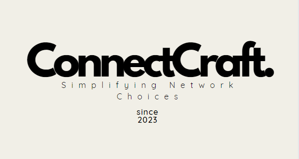
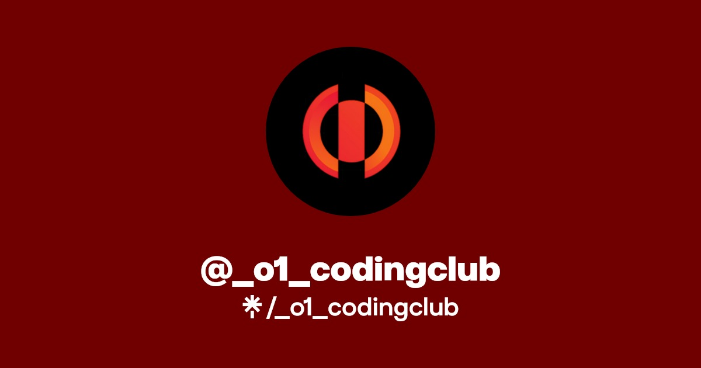
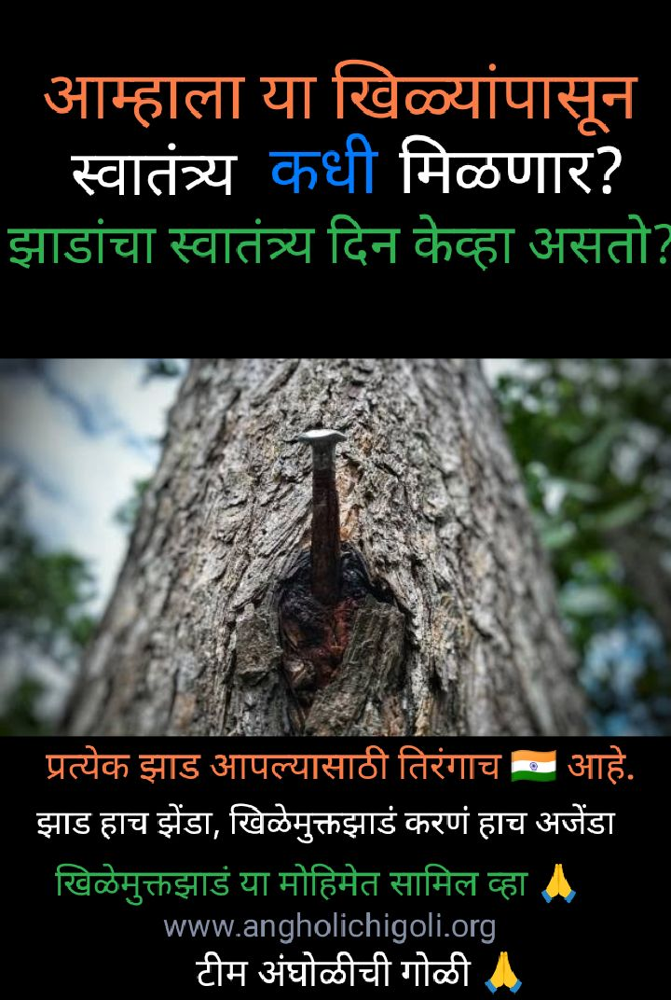

# Data Scientist | AI Associate

#### Technical Skills: C++, Java, Python, SQL, PHP, JavaScript, HTML/CSS, Git, R.
#### Database/Tools: MongoDB, SQL, Firebase, NoSQL, Tableau, Power BI, MS. Excel, AWS, GitHub, Git, VS Code, Visual Studio, PyCharm, Eclipse.
#### Libraries: NumPy, Pandas, Matplotlib, OpenCV, TensorFlow, Tkinter, Scikit-learn, Seaborn, Pytorch.
#### Soft Skills: Leadership, Communications, Grit and Perseverance.

## Education       		
- B.E., Computer Science and Engineering | Savitribai Phule Pune University (_Apr 2024_)
- H.S.C, Bifocal | Kalmadi Shamrao Junior College (_May 2020_) 	

## Work Experience
**AI Associate @ AIT Global India Pvt Ltd (_Dec 2024 - Present_)**
- Currently working with US and UK based clients. Working in a collaborative environment with use of LLM’s and AI tools for optimization, automation and pipelining.

**Data Analyst Intern @ MedTourEasy (_Nov 2024 - Dec 2024_)**
- Worked at MedTourEasy an MNC as a Data Analyst on a project on predictive modelling using R to analyze blood donation patterns, leveraging data preprocessing, machine learning workflows, with tools like caret library.
- During this period I had experienced the hands on working of a Data Analytics Professional and worked under the supervision of project mentor & developed the project entitled “Analyze Death Age Difference of Right Handers with Left Handers”.

**Data Science Intern @ Allusion Systems Pvt Ltd (_Jun 2024 - Oct 2024_)**
- Developed Power BI dashboards to analyze sales, inventory, and customer trends for a clothing and fashion accessories e-commerce platform, driving data-driven decision-making and optimizing operations.
- Assisted in applying ML techniques to drug discovery and clinical trial data, supporting model training and evaluation to improve processes contributing with Innoplexus-AI based company specializing in drug discovery.

**Data Science Mentorship Program @ Persistent Systems (_Feb 2023 - Aug 2023_)**
- Executed the Lead Scoring Project for an Education Company at Persistents, leveraging generative data science techniques to process, generate, and evaluate models, resulting in a 40% increase in conversion rate for promising leads.
- Executed an advanced Data modeling approach to achieve unparalleled accuracy, surpassing industry benchmarks, Explored diverse features and drove insights for data analysis and enhanced performance.

## Projects
### ConnectCraft - Simplifying Network Choices 
[Publication](https://www.ijariit.com/manuscript/connectcraft-simplifying-network-choices/)

- Developed objective strategy for discovering optimal EEG bands based on signal power spectra using **Python**. This data-driven approach led to better characterization of the underlying power spectrum by identifying bands that outperformed the more commonly used band boundaries by a factor of two. The proposed method provides a fully automated and flexible approach to capturing key signal components and possibly discovering new indices of brain activity.
- Engineered feature extraction system processing 1M+ geolocation data points using Java, integrating temporal and spatial patterns for network analysis.
- Automated data collection with Firebase, processing 100GB+ of network data, and built ensemble models reducing false predictions by 35%.

### ETL using AWS-RDS Dream11
[Code](https://github.com/suyog-karpe/ETL-using-AWS-RDS-Dream11)

- Developed an Extract, Transform, Load (ETL) pipeline to process historical IPL match data, creating a Dream11 points system for players.
- Utilized AWS RDS for database management, Python for data processing, and SQL for querying.

### NLP web app
[Code](https://github.com/suyog-karpe/nlp-web-app)

- Developed a web application utilizing NLP techniques to perform tasks like sentiment analysis, text summarization, and keyword extraction.
- Built the app using Flask for backend functionality, integrated NLP libraries (NLTK, SpaCy) for text processing, and designed a user-friendly interface with HTML, CSS, and Bootstrap.

  

## Hackathons & Certifications
- Call for Code (IBM): Recognizing the potential to help farmers generate extra income, designed a solution that streamlined the supply of agro-waste to biofuel factories, leveraging IBM’s watsonx.ai to optimize the process.
- IBM- AI and Data
- Goldman Sachs- Software Engineering
- Tata Group- Cybersecurity Analyst, Data Visualisation
- IIT Bombay- Git Training, Java Training, Python Training.
- NVIDIA- Fundamentals of Deep Learning
- Udemy- Python, C++ Certification.
- Google- Data Analytics Professional Certificate
- British Airways- Data Science
- pwc- Power BI
- BCG- Data Science
- Goethe-Zertifikat A1:Fit in Deutsch 1 --- Issued Oct. 2016

- [Data Science YouTube](https://www.youtube.com/channel/UCa9gErQ9AE5jT2DZLjXBIdA)

## Volunteerning
1. **Association of Computer Engineering Students (ACES)**
  - Guiding a team of 6 CS students in development of ACES Website for the community.
  - Orchestrating workshops,mentoring coding sessions, and events to enhance skills and encourage continuous learning.

    
2. **O(1) Coding Club**
    - Volunteering in developing dynamic websites using HTML, CSS and Python, created a ’URL shortener’ website generated with AI text.
    - Implemented Using Django and deployed using Heroku. Over 1000 active users last recorded in March 2024 also used Data Modelling with SQL to feed into Django.
   
      
3. **Bath Pill NGO**
  - Nailfree Initiative of Trees (For Community Outreach and Advocacy).

  
    

